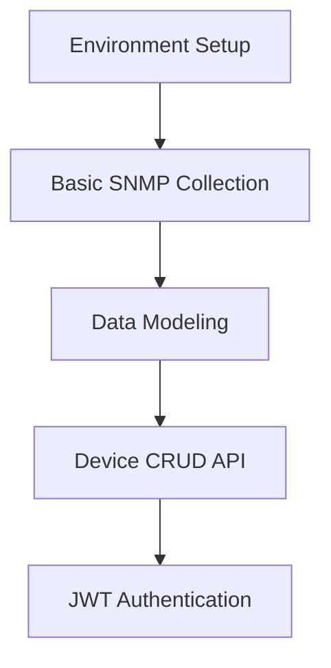

# Network Switch Monitoring - Execution Plan

## Progresso das Fases (Checklist)

### Fase 1: Core System
- [x] Docker Compose com FastAPI, PostgreSQL, Redis
- [ ] SNMP Collector para métricas básicas
- [x] Modelagem de dados
- [x] API CRUD de dispositivos
- [ ] Autenticação JWT *(não necessário neste projeto; removido por decisão de escopo)*

### Fase 2: Monitoramento em Tempo Real
- [ ] Sistema de alertas configurável
- [ ] Frontend com dashboard e topologia
- [ ] Gráficos de séries temporais
- [ ] Dashboard de status agregado
- [ ] **Coleta de métricas avançadas (expansão além do básico: Power, Security, Storage, etc.)**

### Fase 3: Gestão Avançada
- [ ] Asset Manager (inventário, ciclo de vida, dependências)
- [ ] Config Manager (backup automático, diffs, compliance)
- [ ] Relatórios (templates, agendamento, exportação)
- [ ] **Expansão do coletor SNMP para novos OIDs e sensores avançados**

### Fase 4: Otimização e Escala
- [ ] Testes de carga (Locust, simulação em escala)
- [ ] Otimizações (bulk inserts, pooling, cache Redis)
- [ ] Segurança avançada (rotação de credenciais, auditoria, scanning)
- [ ] Entrega final (uptime 99.9% em 72h)

---

## Phase 1: Core System (Weeks 1-4)
### Objective: MVP for Data Collection and Storage


### Deliverables:
- Docker-compose with:
  - FastAPI
  - PostgreSQL
  - Redis
- SNMP Collector for metrics:
  - 1.3.6.1.2.1.1.1.0 (SysDescr)
  - 1.3.6.1.2.1.25.3.3.1.2 (CPU)
  - 1.3.6.1.2.1.2.2.1.8 (IfStatus)
- API Endpoints:
  - `POST /devices` (Add switch)
  - `GET /devices/{id}/metrics` (Retrieve metrics)

## Phase 2: Real-time Monitoring (Weeks 5-8)
### Objective: Live Dashboard and Alerts

### Deliverables:
- Alert system with:
  - Configurable thresholds
  - Exponential backoff
  - Multiple channels (Email/SMS)
- Frontend with:
  - Topology visualization
  - Time-series charts
  - Aggregated status dashboard

Example dashboard component:
```jsx
<RealtimeDashboard>
  <NetworkTopology devices={devices} />
  <MetricChart 
     title="CPU Utilization" 
     metrics={cpuData} 
     threshold={85} />
  <AlertFeed alerts={activeAlerts} />
</RealtimeDashboard>
```

## Phase 3: Advanced Management (Weeks 9-12)
### Objective: Complete Management Features

### Modules:
1. **Asset Manager**:
   - Automatic inventory
   - Lifecycle control
   - Dependency matrix

2. **Configuration Manager**:
   - Automatic backups via SSH
   - Configuration diffs
   - Compliance checking

3. **Report Engine**:
   - Customizable templates
   - Report scheduling
   - PDF/CSV export

## Phase 4: Optimization and Scale (Weeks 13+)
### Objective: Production Readiness

### Critical Tasks:
- Load testing with Locust:
  - Simulate 1,000 devices
  - Evaluate SNMP throughput
  - Monitor resource consumption

### Optimizations:
- TimescaleDB bulk inserts
- SNMP connection pooling
- Redis query caching

### Security:
- Credential rotation
- Access auditing
- Vulnerability scanning

## Delivery Schedule
| Phase | Deliverable | Acceptance Criteria |
|-------|------------|---------------------|
| 1 | Core System | Collect 10+ metrics per device |
| 2 | Live Dashboard | <2s latency for 100 devices |
| 3 | Asset Management | Working backup/config recovery |
| 4 | Production Ready v1.0 | 99.9% uptime in 72h test |

## Risks and Mitigation
| Risk | Mitigation |
|------|------------|
| Model differences | OID mapping by vendor/model |
| High latency | Edge computing for remote locations |
| Compromised credentials | Vault secrets + 2FA |

---

## Lessons Learned & Operational Best Practices

### Environment & Configuration
- Always use the `.env` file for all configuration. Ensure it is loaded by Docker Compose, FastAPI, and Alembic migrations.
- The database URI (`SQLALCHEMY_DATABASE_URI`) must be consistent everywhere. Use the Pydantic `Settings` object to avoid mismatches.
- In Docker Compose and `.env`, set `POSTGRES_SERVER=db` (not `localhost`).

### Database Migrations
- Always run Alembic migrations after (re)building the stack:
  ```bash
  docker-compose exec app alembic upgrade head
  ```
- If you see `relation does not exist`, check DB URI and re-apply migrations.
- Use `init_db()` only if migrations are not available or incomplete.

### API Usage & Testing
- Use trailing slashes in all FastAPI endpoints to avoid 307 redirects.
- Clean up test data before running bulk or scripted tests to avoid duplication errors.
- Test endpoints step-by-step for clarity and to identify issues early.

### Troubleshooting
- Check logs for connection or migration errors:
  ```bash
  docker-compose logs app
  docker-compose logs db
  ```
- If DB connection refused, verify DB container health and `.env`/Compose settings.
- For common issues and solutions, see `TROUBLESHOOTING.md`.

### Documentation
- All critical steps, pitfalls, and fixes are now documented in:
  - `README.md` (entry point, quick start, troubleshooting index)
  - `TROUBLESHOOTING.md` (common errors, solutions, FAQ)
  - Inline comments in config and Compose files

This section should be reviewed and updated after every significant deployment or troubleshooting session to keep operational knowledge current.
